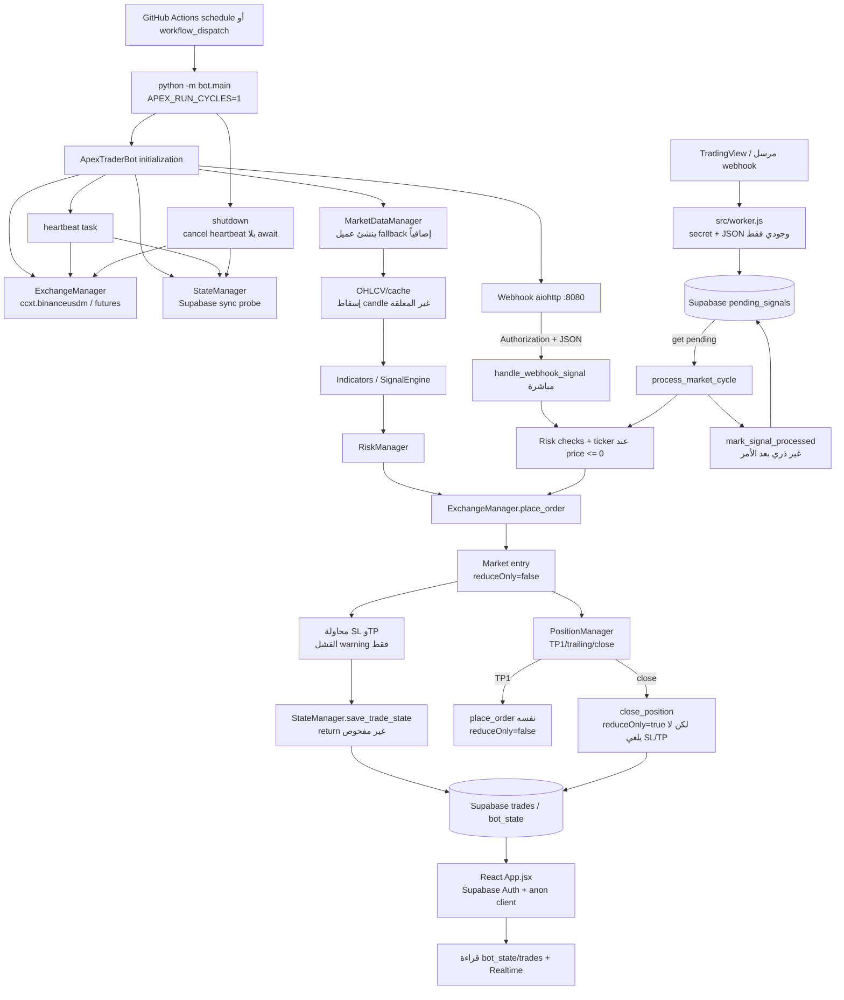

# التدقيق النهائي الموحّد — APEX-TRADER

**نوع التدقيق:** مراجعة ساكنة نهائية للكود والبيانات والويب والأمن والتزامن ومخاطر التداول

**تاريخ المراجعة:** 2026-09-26

## 1. القرار التنفيذي

**القرار: NO-GO للتداول الحقيقي (Live).**

القرار لا يعتمد على نجاح الاختبارات المحلية، بل على أدلة مباشرة في مسارات التنفيذ والحالة: يمكن لمسار CI المجدول الوصول إلى Binance Live بمجرد ضبط `BINANCE_TESTNET=false`، وأوامر الحماية قد تفشل بعد الدخول من دون إلغاء/إغلاق تعويضي، والإغلاق الجزئي يمر عبر أمر دخول `reduceOnly=False`، وحد الخسارة اليومية الافتراضي محسوب كوحدة خاطئة ويُصفّر عند كل عملية. كذلك لا توجد حماية idempotency/claim ذرية، ولا ضمان أن حالة قاعدة البيانات تطابق الأمر المنفذ.

لا يجوز الانتقال إلى Live قبل إغلاق جميع النتائج الحرجة والعالية أدناه، وإثباتها بمراجعة كود واختبارات sequence/failure/concurrency/restart مع بيئة اختبار معزولة. **لم يُنفّذ تداول، ولم تُستخدم مفاتيح أو بيانات خارجية، ولا يُعد هذا التقرير تصريحاً بأن أي إصلاح قد طُبّق.**

## 2. حدود التدقيق والمنهج

### شُمِل

- مسارات بدء البوت، heartbeat، دورة السوق، webhook المباشر، `pending_signals`، الإغلاق، shutdown، وإدارة الموارد.
- `ExchangeManager` و`MarketDataManager` و`RiskManager` و`PositionManager` و`StateManager` ومحرك الإشارات والإشعارات.
- `database/schema.sql`، `src/worker.js`، React `web/src/App.jsx`، إعدادات Vite/Wrangler/headers/env، `package.json`، CI، الاختبارات وملف التشخيص.
- تتبع البيانات من OHLCV/ticker إلى signal/risk/order، ثم `trades`/`bot_state`، ثم لوحة React.

### لم يُنفّذ

- لم تُستخدم مفاتيح Binance/Bybit/Supabase/Telegram/Redis، ولم تُرسل أوامر أو webhooks حقيقية.
- لم تُختبر صلاحيات Supabase/RLS فعلياً، ولا Realtime، ولا API خارجي، ولا fuzzing أو dynamic security testing أو CVE scan قابل لإعادة الإنتاج.
- لا يمكن من القراءة الساكنة إثبات grants الفعلية في مشروع Supabase أو قبول/رفض صيغ أوامر منصة بعينها.
- لم يُعتبر نجاح `compileall` أو `node --check` أو build أو الاختبارات المحلية دليلاً على سلامة التداول. لا تُستخدم بيانات سوق مصطنعة كدليل؛ الاختبارات التي تنشئ كائنات/أسعاراً ثابتة لا تثبت سلوك المنصة أو fills أو الحماية.
- لم يثبت الفحص وجود SQL injection أو SSRF من القراءة الساكنة؛ هذا ليس ضماناً ديناميكياً شاملاً.

## 3. خريطة الملفات ومسؤولياتها

| المنطقة | الملفات | المسؤولية المرصودة |
|---|---|---|
| الإعداد | `bot/config.py`, `.env.example`, `requirements.txt` | مفاتيح المنصة، testnet، المنصة الأساسية، الحدود، الرموز، Supabase وwebhook |
| التشغيل | `bot/main.py` | تهيئة المكونات، heartbeat، دورة السوق، webhook، sizing، حفظ الحالة، shutdown |
| التنفيذ | `bot/core/exchange.py` | إنشاء عميل `ccxt.binanceusdm`، ticker/OHLCV، market entry، SL/TP، close |
| بيانات السوق | `bot/data/market_data.py` | عميل بيانات مستقل/fallback، load markets، cache، OHLCV وإسقاط الشمعة غير المغلقة |
| المخاطر/المركز | `bot/core/risk_manager.py`, `bot/core/position_manager.py`, `bot/core/fee_calculator.py` | confidence، التعرض/الخسارة المحتملة، trailing، TP1/TP2، PnL والرسوم |
| الحالة | `bot/data/state_manager.py`, `database/schema.sql` | `bot_state`، `pending_signals`، `trades`، الاستعادة والانتقالات |
| الإدخال الخارجي | `src/worker.js`, `bot/main.py:_webhook_handler` | secret، JSON، إدخال `pending_signals` أو تنفيذ مباشر |
| الإشارات | `bot/signals/*`, `bot/strategies/*` | مؤشرات واتجاهات وثقة واستراتيجيات |
| الواجهة | `web/src/App.jsx`, `web/src/style.css` | Supabase Auth، قراءة مباشرة لـ`bot_state`/`trades`، العرض وRealtime |
| الأتمتة | `.github/workflows/binance.yml` | schedule/workflow_dispatch، تثبيت Python، tests، دورة البوت، التشخيص وartifacts |
| التشخيص/الاختبارات | `bot/tests/diagnostic_supabase.py`, `tests/*` | فحص الاتصال، اختبارات منطقية محلية وفجوات التغطية |

## 4. تدفق التشغيل المرصود

1. يبدأ GitHub Actions كل 15 دقيقة أو يدوياً، ويضع مفاتيح Binance وSupabase وTelegram على مستوى الـjob ثم يشغّل `python -m bot.main` بدورة واحدة (`APEX_RUN_CYCLES=1`).
2. `ApexTraderBot` ينشئ `ExchangeManager`، ثم `MarketDataManager(exchange_source=self.exchange)`، ثم `StateManager`. `StateManager` ينفذ probe متزامناً إلى Supabase داخل constructor.
3. `initialize()` يقرأ الحالة المفتوحة، يجلب الرصيد، ويكتب الحالة المالية. heartbeat تكتب حالة دورية وتعيد حساب حد الخسارة.
4. في دورة السوق، يقرأ البوت `pending_signals`، ثم يستدعي `_execute_webhook_signal`/`handle_webhook_signal` قبل تعليم الصف `processed`. وفي المسار العادي يجلب OHLCV، يحسب المؤشرات والإشارة، يجلب ticker، يطبق risk، ثم يرسل market order.
5. `ExchangeManager.place_order()` يرسل market entry ثم يحاول SL وTP. فشل أي حماية يسجّل warning ويعيد أمر الدخول.
6. بعد الأمر، يُبنى `trade_record` ويُرسل إلى `StateManager.save_trade_state()`، لكن النتيجة لا تُفحص. في pending فقط يُستدعى `mark_signal_processed()` بعد التنفيذ، بلا claim ذري.
7. عند TP1، يغيّر `PositionManager` العلم قبل التنفيذ، ويستعمل main `place_order()` نفسه، وليس واجهة reduce-only صريحة. عند الإغلاق النهائي، يُحسب PnL محلياً من السعر الحالي لا من fills.
8. React ينفذ Supabase Auth كحارس واجهة، ثم يقرأ `bot_state` و`trades` مباشرة بالـanon key ويشترك في Realtime. هذا الحارس ليس بديلاً عن RLS.

## 5. شجرة التشغيل (Mermaid)

## 6. النتائج المؤكدة الموحّدة

> رُقّمت النتائج بعد دمج النتائج المتكررة من تقارير الخبراء. كل نتيجة أدناه لها دليل في الكود المحلي؛ حيث تكون قابلية الاستغلال مشروطة بإعداد خارجي، ذُكر الشرط صراحة.

### C-01 — حرجة — مسار CI يستطيع الوصول إلى Live بلا بوابة مستقلة

- **severity:** حرجة
- **confidence:** مؤكد من القراءة الساكنة
- **file:line:** `bot/config.py:56-58`; `bot/core/exchange.py:29-35,48-62`; `bot/main.py:311-319,458-465`; `.github/workflows/binance.yml:3-5,12-24,91-95`
- **evidence:** `BINANCE_TESTNET` افتراضه true لكنه يقبل false؛ عند false لا يُستدعى `set_sandbox_mode` ويُنشأ Binance Futures Live. الـworkflow المجدول/اليدوي يمرر مفاتيح Binance ويشغّل دورة البوت. لا يوجد `ALLOW_LIVE_TRADING` أو allowlist أو موافقة قبل `create_order`.
- **impact:** ضبط secret واحد قد يحول الـjob نفسه إلى مسار أوامر حقيقية، بلا بيئة Live محمية أو قاطع مستقل.
- **fix:** اجعل Live مرفوضاً افتراضياً ببوابة `ALLOW_LIVE_TRADING` سرية ومراجعة، افصل workflow Live ببيئة GitHub محمية وموافقة، وحقق قبل كل أمر من البيئة والمنصة والرمز والحدود.
- **verification:** static check يرفض Live دون البوابة؛ اختبار adapter يسجل endpoint sandbox/live ويثبت رفض الأمر عند غياب الموافقة؛ مراجعة صلاحيات environment دون استخدام مفاتيح حقيقية.

### C-02 — حرجة مشروطة — RLS والسياسات غير موجودة في schema، والواجهة تعتمد على حارس React

- **severity:** حرجة (قابلية الوصول الفعلية مشروطة بـgrants إعداد Supabase)
- **confidence:** مؤكد أن schema لا يفعّل RLS؛ الاستغلال الفعلي لم يُختبر
- **file:line:** `database/schema.sql:24-57,82-161,171-187`; `web/src/App.jsx:15-21,169-189,625-675`
- **evidence:** لا توجد `ENABLE ROW LEVEL SECURITY` أو policies؛ بل تذكر schema أنها توصية. React يحمل `VITE_SUPABASE_ANON_KEY` ويقرأ `bot_state` و`trades` مباشرة، بينما تسجيل الدخول يحدث في React فقط.
- **impact:** إذا سمحت grants العامة بالقراءة/الكتابة، يمكن تجاوز شاشة الدخول باستدعاء Data API/Realtime مباشرة؛ لا يثبت الكود أن anon ممنوع.
- **fix:** فعّل RLS لكل الجداول، عرّف policies مرتبطة بالدور/`auth.uid()`، امنع كتابة anon، واجعل الكتابة من خدمة موثوقة فقط، واختبر anon/authenticated/Realtime في مشروع معزول.
- **verification:** migration مراجعة؛ اختبارات صلاحيات فعلية من anon ومستخدم مصرح وservice-role في مشروع غير إنتاجي.

### C-03 — حرجة — الدخول ينجح حتى عند فشل SL أو TP

- **severity:** حرجة
- **confidence:** مؤكد من control flow
- **file:line:** `bot/core/exchange.py:152-205`; `bot/main.py:311-352,458-497`
- **evidence:** market order يُرسل أولاً. استثناء SL في `182-183` واستثناء TP في `202-203` يسجلان warning فقط، ثم تعيد `place_order()` أمر الدخول في `205`. main يحفظ الحالة `OPEN` دون اشتراط نجاح أوامر الحماية.
- **impact:** قد يبقى مركز futures مفتوحاً بلا وقف/هدف، بينما يعتقد النظام أنه محمي.
- **fix:** اجعل نجاح الحماية شرطاً للنجاح؛ خزّن IDs والحالات، أعد المحاولة بمهلة محدودة، ثم أغلق/اعكس الدخول reduce-only أو اعزل المركز `UNPROTECTED` وأوقف فتح صفقات جديدة حتى reconciliation.
- **verification:** adapter mock حتمي يرفض SL/TP ويثبت عدم إعلان `OPEN` أو يثبت الإغلاق التعويضي؛ reconciliation يتحقق من كل حماية.

### C-04 — حرجة — TP1 يستخدم مسار فتح ولا يثبت نجاح الإغلاق الجزئي

- **severity:** حرجة
- **confidence:** مؤكد من الكود
- **file:line:** `bot/core/exchange.py:153-159`; `bot/core/position_manager.py:301-318,329-337`; `bot/main.py:180-208`
- **evidence:** `PositionManager` يضبط `tp1_executed=True` قبل التنفيذ. main يحسب الكمية ثم يستدعي `exchange.place_order()`، وهذه الدالة ترسل `params={"reduceOnly": False}`. الاستثناء يُسجل، ثم تُحفظ `tp1_executed=True` ويُرسل إشعار partial close خارج كتلة الفشل.
- **impact:** قد يزيد المركز أو يعكس التعرض بدلاً من خفضه؛ وقد تضيع إعادة المحاولة بعد فشل TP1، مع PnL وحجم نهائي غير صحيحين.
- **fix:** أضف API `reduce_only_close` بكمية منصة فعلية؛ غيّر الحالة والإشعار بعد fill/نجاح مؤكد فقط؛ خزّن المتبقي والرسوم وrealized PnL لكل partial.
- **verification:** اختبار sequence يثبت `reduceOnly=true` والكمية الصحيحة، وفشل الأمر لا يغير العلم ولا يرسل نجاحاً.

### C-05 — حرجة — تعريف الحجم والرافعة وPnL غير متسق

- **severity:** حرجة
- **confidence:** مؤكد من القراءة الساكنة
- **file:line:** `bot/main.py:285-315,322-324,359-366`; `bot/core/risk_manager.py:125-133`; `bot/core/position_manager.py:72-103`; `bot/core/exchange.py:153-159`
- **evidence:** الحجم يُحسب من `initial_balance * max_position_pct`، والأمر يرسل `size_usd / entry_price`؛ لا يوجد `set_leverage` أو `leverage` في params. في المقابل Position/PnL والرسوم تستخدم `size_usd * leverage`، وRiskManager يحسب potential loss على `size_usd` فقط.
- **impact:** notional والهامش والتعرض والرافعة والرسوم وPnL وحد الخطر قد تشير إلى صفقات مختلفة، خصوصاً بعد تغير الرصيد أو اختلاف الرافعة الفعلية.
- **fix:** عرّف `size_usd` صراحة كهامش أو notional، احسب من free balance وrisk-at-stop، اضبط الرافعة وتحقق منها، ووحّد كل الحسابات على filled amount/notional.
- **verification:** اختبارات adapter على fill/fees/leverage مع assertions، ومطابقة سجل الصفقة مع executions؛ لا يكفي اختبار حسابي مستقل.

### C-06 — حرجة — حد الخسارة اليومية 400% تقريباً ويُفقد عند إعادة التشغيل

- **severity:** حرجة
- **confidence:** مؤكد من القراءة الساكنة
- **file:line:** `bot/config.py:132-149`; `bot/main.py:52-54,82-90,103-114,252-259,378-384`; `bot/data/state_manager.py:52-63`; `database/schema.sql:47-49`
- **evidence:** `MAX_DAILY_LOSS_PCT=4.0` يُضرب مباشرة في الرصيد بلا `/100`، فينتج 4× الرصيد. العدادات تبدأ صفراً في كل process، و`load_initial_state()` لا يستعيد daily loss/day key من `bot_state`. كما يتغير الحد مع كل heartbeat balance.
- **impact:** حاجز 4% المقصود لا يعمل كوحدة صحيحة، وCI المجدول يعيد ضبط العداد، لذلك قد يستمر فتح الصفقات بعد خسائر اليوم.
- **fix:** وحّد التحويل إلى كسر عشري، ثبّت baseline ليوم UTC، خزّن واستعد day key والعداد atomically، وأوقف market وwebhook عند تجاوز الحد أو فشل استعادة الحالة.
- **verification:** اختبارات حدود 3.99%/4%/4.01%، restart بين دورتين، وتنافس عاملين على تحديث العداد باستخدام قاعدة اختبار معزولة.

### C-07 — حرجة — pending/webhook بلا idempotency أو claim ذري

- **severity:** حرجة
- **confidence:** مؤكد من ترتيب القراءة/الكتابة
- **file:line:** `src/worker.js:47-67`; `database/schema.sql:82-113`; `bot/data/state_manager.py:224-254`; `bot/main.py:132-143,394-400,458-497,525-555`; `.github/workflows/binance.yml:3-5`
- **evidence:** Worker يضيف صفاً لكل POST، و`webhook_id` ليس UNIQUE. البوت يقرأ كل `pending` ثم ينفذ قبل `processed`. `mark_signal_processed` يحدث حسب id فقط ولا يشترط `status=pending` أو يتحقق من الصف المتأثر. المسار المباشر قد يتزامن مع poller، ولا يوجد lock أو workflow concurrency.
- **impact:** replay أو عاملان متزامنان قد يرسلان أمرين لنفس الإشارة/الرمز؛ crash أو فشل DB بعد الأمر يترك الحالة قابلة لإعادة التنفيذ.
- **fix:** `UNIQUE(webhook_id)` وupsert/رفض التكرار، claim ذرية `pending→processing` مع owner/lease وrecovery، lock لكل symbol، وidempotency key مرتبط بأمر المنصة؛ أضف `concurrency` للـCI.
- **verification:** اختباران متوازيان لنفس webhook، crash بعد order وقبل mark، وإثبات أمر واحد فقط مع transaction/RPC حقيقية معزولة.

### C-08 — عالية — تحقق webhook وجودي فقط ويمكن أن يمرر رمزاً/سعراً غير مقيد

- **severity:** عالية (الاستغلال يتطلب secret/صلاحية الوصول)
- **confidence:** مؤكد من القراءة الساكنة
- **file:line:** `src/worker.js:25-33,47-54`; `bot/main.py:368-424,543-550`; `database/schema.sql:82-113`
- **evidence:** Worker يتحقق من وجود `symbol/side/action` فقط، ويأخذ price/id كما هما. handler يفرض enum جزئياً، لكن `handle_webhook_signal` يحول price إلى float، ويستخدم السعر الوارد مباشرة إذا كان موجباً، ولا توجد allowlist للرموز أو finite/range/deviation/body-size checks. أي side غير buy يتحول عملياً إلى sell داخل handler.
- **impact:** مدخل مصادق عليه قد يوجه أمراً إلى سوق غير مقصود أو بسعر stale/مصطنع، أو يترك صفاً فاسداً pending.
- **fix:** schema موحد صارم في Worker والبوت، allowlist للرموز، enums exact، price موجب finite ضمن انحراف من ticker، حدود body/length، ورفض القيم الزائدة؛ أعد حساب entry من السوق عند الحاجة.
- **verification:** property/negative tests للأنواع والقيم الزائدة والرموز والأسعار؛ لا تستخدم أسعار سوق مصطنعة لإثبات سلامة التنفيذ.

### C-09 — حرجة عند اختيار Bybit — البيانات قد تأتي من منصة والتنفيذ من Binance

- **severity:** حرجة مشروطة بـ`PRIMARY_EXCHANGE=bybit`
- **confidence:** مؤكد من القراءة الساكنة
- **file:line:** `bot/config.py:60-88`; `bot/core/exchange.py:17-62`; `bot/data/market_data.py:29-86,465-573`; `bot/main.py:333-334`
- **evidence:** `ExchangeManager` ينشئ دائماً `ccxt.binanceusdm` ومفاتيح Binance، بصرف النظر عن `PRIMARY_EXCHANGE`. `MarketDataManager` قد ينشئ Bybit ويطبّع رموزها، لكنه عند `exchange_source` يجلب OHLCV من عميل ExchangeManager؛ التسجيل يحفظ اسم primary لا adapter المؤكد. لا يوجد spot adapter فعلي.
- **impact:** عند Bybit قد تختلف السوق/الرمز/السعر والحساب عن مكان التنفيذ، وقد ينفذ futures حين يتوقع المشغل spot أو منصة أخرى.
- **fix:** adapter واحد يملك data/order/lifecycle حسب المنصة ونوع الحساب، أو ارفض Bybit/spot صراحة حتى يكتمل الدعم؛ تحقق من adapter الفعلي قبل التداول والتسجيل.
- **verification:** contract tests مستقلة لكل adapter مع symbol mapping وaccount type، ثم smoke test غير مالي في sandbox مع مفاتيح اختبار منفصلة.

### C-10 — عالية — لا توجد precision أو minimum/step/cost checks قبل الأوامر

- **severity:** عالية
- **confidence:** مؤكد من القراءة الساكنة
- **file:line:** `bot/core/exchange.py:135-205,211-243`; `bot/main.py:312-318,459-466`
- **evidence:** amount وstopPrice تُرسلان خاماً. لا يوجد `load_markets()` في طبقة التنفيذ، ولا `amount_to_precision`/`price_to_precision` ولا فحص limits/step/tick/cost.
- **impact:** قد يُرفض الدخول أو الحماية، أو تقرّب المنصة السعر/الكمية بطريقة غير متوقعة؛ وهذا يفاقم C-03 وC-04.
- **fix:** حمّل metadata، طبّق precision وحدود السوق قبل كل أمر، وارفض الحجم غير الصالح قبل الدخول والإغلاق.
- **verification:** اختبارات لكل symbol metadata وحالات تحت الحد/على الحد/فوقه، مع assertions على payload النهائي.

### C-11 — عالية — PnL والرسوم والإغلاق النهائي لا تعتمد على fills الفعلية

- **severity:** عالية
- **confidence:** مؤكد من القراءة الساكنة
- **file:line:** `bot/main.py:211-245,322-350`; `bot/core/position_manager.py:350-375`; `bot/core/exchange.py:220-249`
- **evidence:** close يرسل market order ثم يحسب من `current_price`، وentry يسجل ticker لا fill. الرسوم تقديرية، ولا تُقرأ execution fees/funding/slippage. `close_position()` يحسب القيمة الأصلية بعد TP1.
- **impact:** PnL وdaily loss واللوحة قد لا تمثل النتيجة المحققة، وقد يسمح الحاجز بالتداول بناءً على خسارة غير صحيحة.
- **fix:** استخدم average fill/filled amount/fees/ledger، افصل realized PnL لكل partial، وحالة الإغلاق لا تكتمل قبل reconciliation.
- **verification:** اختبارات order responses متعددة fills ورسوم/funding، ومقارنة السجل بالحالة المستخرجة من adapter.

### C-12 — عالية — حفظ الصفقة فشل-مفتوح ونتيجته متجاهلة

- **severity:** عالية
- **confidence:** مؤكد من الاستدعاءات
- **file:line:** `bot/data/state_manager.py:139-152`; `bot/main.py:321-353,468-498`
- **evidence:** `save_trade_state()` يلتقط الاستثناء ويعيد `False`. main يستدعيه دون فحص return ودون state machine أو reconciliation. في webhook قد يُعتبر التنفيذ ناجحاً رغم عدم حفظ `trades`.
- **impact:** مركز موجود على المنصة قد يختفي من DB بعد restart؛ إعادة المحاولة قد تضع أمراً ثانياً أو تترك المركز بلا إدارة.
- **fix:** حالات صريحة `PENDING_ORDER/OPEN/STATE_SYNC_FAILED`، retry محدود، idempotency على order ID، reconciliation من positions/orders، ولا تعلن نجاحاً قبل حفظ مؤكد أو عزل المركز.
- **verification:** حقن فشل DB بعد order في adapter اختبار، ثم إثبات عدم تكرار الأمر وظهور حالة reconciliation.

### C-13 — عالية — استدعاءات Supabase المتزامنة تحجب event loop

- **severity:** عالية
- **confidence:** مؤكد من API calls الظاهرة
- **file:line:** `bot/data/state_manager.py:34-40,52-81,85-132,139-249`; `bot/main.py:100-115,132-163,199-245,395-497`
- **evidence:** `.execute()` المتزامن يُستدعى داخل دوال async ومسار `process_market_cycle` بلا async client أو `asyncio.to_thread` أو timeout. constructor ينفذ probe شبكياً.
- **impact:** قد يتوقف event loop أثناء DB I/O، فتتأخر webhook والheartbeat والإلغاء وتزداد احتمالات التداخل.
- **fix:** عميل Supabase async أو `to_thread` مع timeout/semaphore، وانقل probe إلى `initialize()`.
- **verification:** اختبار event-loop responsiveness تحت DB delay، مع timeout وإلغاء، دون الاتصال بقاعدة إنتاجية.

### C-14 — عالية — إلغاء heartbeat أثناء shutdown بلا انتظار

- **severity:** عالية
- **confidence:** مؤكد من control flow؛ أثر الشبكة لم يُختبر
- **file:line:** `bot/main.py:567-600`
- **evidence:** `heartbeat_task.cancel()` يتبعه مباشرة update/mark/stop وإغلاق exchange، بلا `await heartbeat_task` أو gather ومعالجة `CancelledError`. heartbeat نفسها تستخدم exchange وSupabase.
- **impact:** سباق بين heartbeat وكتابة حالة التوقف وإغلاق connector، وقد تكتب نبضة بعد `is_running=false` أو تفشل أثناء الإغلاق.
- **fix:** cancel ثم await/gather قبل كتابة الحالة وإغلاق الموارد، واجعل loop تخرج صراحة عند CancelledError.
- **verification:** lifecycle test يلغي المهمة أثناء كل await ويتحقق من ترتيب الإغلاق وعدم الكتابة بعد stop.

### C-15 — عالية — حماية trailing/high-low لا تُحفظ بشكل موثوق بعد التغيير/restart

- **severity:** عالية
- **confidence:** مؤكد من مسار state
- **file:line:** `bot/main.py:163-180`; `bot/core/position_manager.py:121-127,156-299`; `bot/data/state_manager.py:170-213`; `database/schema.sql:151-160`
- **evidence:** `update_price()` يغير trailing/high/low والflags، لكن main لا يحفظ عند نتيجة `none` أو مجرد تحديث trailing. عند `add_position()` تُعاد `highest_price` و`lowest_price` إلى entry، ما يطغى على القيم المستعادة.
- **impact:** بعد restart قد تتراجع الحماية أو تختلف عن آخر حالة معروضة، فتتخذ قرارات خروج غير صحيحة.
- **fix:** احفظ كل تغير حماية ذرياً أو اشتقه من أوامر/بيانات المنصة، ولا تطغَ على high/low الصحيحة عند reconstruct.
- **verification:** restart test أثناء trailing/breakeven، مع مقارنة الحالة قبل/بعد ومنع reset غير المبرر.

### C-16 — عالية — إغلاق المركز لا يلغي أوامر SL/TP المعلقة

- **severity:** عالية
- **confidence:** مؤكد أن مسار الإلغاء غير موجود؛ سلوك المنصة اللاحق لم يُختبر
- **file:line:** `bot/core/exchange.py:165-203,211-249`
- **evidence:** `place_order()` لا يحفظ IDs لأوامر SL/TP، و`close_position()` يرسل reduce-only market فقط ولا يستدعي cancel orders أو يتحقق من open orders.
- **impact:** قد تبقى أوامر حماية stale بعد الإغلاق، ما يسبب رفضاً أو تعارضاً أو تعرضاً غير مقصود وفق سلوك المنصة.
- **fix:** خزّن IDs، ألغ الحماية عند الإغلاق، وتحقق من عدم بقاء open protective orders قبل إنهاء الحالة.
- **verification:** adapter contract test يتتبع IDs ويثبت ترتيب cancel/close/reconciliation.

### C-17 — متوسطة/عالية — عقد `bot_state` غير متطابق مع React

- **severity:** متوسطة تشغيلية، عالية لسلامة المراقبة
- **confidence:** مؤكد من مقارنة schema والكتابة والقراءة
- **file:line:** `database/schema.sql:25-57`; `bot/data/state_manager.py:73-111`; `web/src/App.jsx:280-375,392-443,518-535`
- **evidence:** schema والبوت يكتبان `last_run_at`, `current_balance`, `daily_*`، بينما React يعرض `heartbeat_at`, `bot_status`, `available_balance`, `daily_unrealized_pnl`, service flags و`cycle_completed_at` غير المعرفة/غير المكتوبة في schema الحالية.
- **impact:** قد تعرض اللوحة `—` أو `غير معروف` أو freshness/status مضللاً، فتخفي توقفاً أو فشل مزامنة.
- **fix:** DTO/schema موحد، migration صريحة، مصدر واحد لاسم heartbeat/status، وعقد اختبار يطابق كل حقل.
- **verification:** contract test يقرأ row حقيقياً من schema اختبارية ويثبت أن كل metric له مصدر ووقت تحديث.

### C-18 — متوسطة/عالية — MarketDataManager مكرر، ينشئ عميلاً إضافياً ولا يُغلقه

- **severity:** متوسطة تشغيلية
- **confidence:** مؤكد من الإنشاء والإغلاق
- **file:line:** `bot/data/market_data.py:19-38,40-86,444-451,455-573,862-868`; `bot/main.py:36-38,590-600`
- **evidence:** الفئة معرفة مرتين والتعريف الثاني يخفي الأول. عند تمرير `exchange_source` يُنشأ fallback ccxt محلي؛ بعض العمليات تستخدمه بينما fetch يستخدم source. `close()` موجود لكن shutdown يغلق `self.exchange` فقط.
- **impact:** lifecycle غير واضح، عميل/connector قد يبقى مفتوحاً، وقد تتكرر metadata requests أو تختلف ملكية cache/rate limit.
- **fix:** احذف التعريف المكرر، لا تنشئ fallback مع source أو حدد الملكية، وأغلق `market_data` قبل المصدر في finally.
- **verification:** lifecycle test يتحقق من close لكل client، وsingle-flight test لتهيئة markets/cache.

### C-19 — متوسطة — لا توجد body-size/rate-limit/backpressure/timeout كافية لمسار webhook

- **severity:** متوسطة
- **confidence:** مؤكد من غياب الحدود في الكود
- **file:line:** `src/worker.js:5-25,56-67`; `bot/main.py:507-555`; `bot/data/state_manager.py:75-81,145,163,246-249`
- **evidence:** Worker يستدعي `request.json()` وSupabase `fetch()` بلا AbortSignal/timeout؛ aiohttp يقرأ JSON بلا body limit/rate limiter؛ لا توجد bounded queue أو حد pending.
- **impact:** body/طلبات كثيرة قد تستهلك الموارد أو تراكم rows، والمهلة الخارجية قد تسبب retries تزيد خطر التكرار الموجود في C-07.
- **fix:** حد body مبكر، schema قبل الكتابة، WAF/rate limit وburst quota، timeout/retry محدود، queue bounded وحد عمر/عدد pending.
- **verification:** load/timeout tests في بيئة معزولة مع assertions على 413/429 وعدم تراكم غير محدود.

### C-20 — متوسطة — تشخيص CI يكتب قاعدة التشغيل ويرفع بياناتها

- **severity:** متوسطة
- **confidence:** مؤكد من القراءة الساكنة
- **file:line:** `bot/tests/diagnostic_supabase.py:42-50,68-114`; `.github/workflows/binance.yml:97-111`
- **evidence:** التشخيص ينفذ upsert لصف `id=999` بقيمة `current_balance=99999.0` ثم يقرأ الصف، ويطبع row/response في JSON؛ workflow يشغله `if: always()` ويرفع الملف artifact.
- **impact:** تغيير قاعدة التشغيل، كشف balance/last_error/response في artifacts، وتوسيع أثر أسرار job.
- **fix:** احذف write test من workflow التداول، استخدم مشروع اختبار معزول، لا تطبع URL/rows، redaction وretention وصلاحيات artifact.
- **verification:** CI dry run على مشروع اختبار يثبت عدم وجود writes أو بيانات حساسة في artifacts.

### C-21 — متوسطة — Actions غير مثبتة إلى SHA وJavaScript بلا lockfile متتبع

- **severity:** متوسطة
- **confidence:** مؤكد من workflow وحالة المستودع
- **file:line:** `.github/workflows/binance.yml:27-35,105-119`; `web/package.json:11-24`; حالة Git: `web/package-lock.json` غير متتبع
- **evidence:** checkout/setup-python/upload-artifact تستخدم tags متحركة، وكل env الحساس على مستوى job. حزم الويب تستخدم `^` ولا يوجد lockfile ضمن الملفات المتتبعة.
- **impact:** تغيير action أو dependency قد يدخل كوداً مختلفاً إلى job يملك مفاتيح التداول؛ البناء غير قابل لإعادة الإنتاج. لا يثبت هذا CVE محدداً.
- **fix:** ثبّت actions إلى SHA موثوق، قلّل الأسرار إلى الخطوات اللازمة، أضف lockfile إلى Git واستخدم `npm ci` ومراجعة dependency tree.
- **verification:** مراجعة workflow بسلاسل SHA، build متكرر من lockfile، ومراجعة `npm audit`/قائمة الاعتماديات دون نسبة CVE بلا دليل.

### C-22 — متوسطة — السجلات والتنبيهات قد تكشف مدخلات وأخطاء تشغيلية

- **severity:** متوسطة
- **confidence:** مؤكد من مواقع التسجيل
- **file:line:** `bot/main.py:141-143,355-357,376,498,549`; `bot/data/state_manager.py:150-152,166-168,252-254`; `bot/notifications/telegram_notifier.py:311-325`; `bot/tests/diagnostic_supabase.py:73-80,96-114`
- **evidence:** تُرسل `str(e)` إلى Telegram، وتُسجل بيانات webhook/السعر/id، ويسجل handler كامل `data` عند invalid signal؛ التشخيص يحفظ rows/response. القص/HTML escaping في Telegram ليس redaction عاماً.
- **impact:** قد تتسرب قيم مدخلات أو URLs/رسائل مزود/معرفات تشغيلية إلى Telegram وGitHub logs/artifacts.
- **fix:** event IDs ورسائل مصنفة، redaction للـURLs/headers/secrets، منع body الكامل وexception raw، retention وصلاحيات واختبارات عدم التسريب.
- **verification:** secret-canary logging test، مراجعة artifact/Telegram sink، وسياسة retention قابلة للتدقيق.

### C-23 — متوسطة — `MIN_CONFIDENCE` المعلن لا يغيّر بوابة التنفيذ

- **severity:** متوسطة
- **confidence:** مؤكد من القراءة الساكنة
- **file:line:** `bot/config.py:147`; `bot/signals/signal_engine.py:41-47`; `bot/core/risk_manager.py:85-92`
- **evidence:** البوابات تستخدم `0.65` ثابتة، بينما `RiskConfig.min_confidence` لا تُقرأ.
- **impact:** تغيير env لا يطابق سلوك البوت المتوقع، وقد تمر/ترفض إشارات خلاف سياسة المشغل.
- **fix:** مرر config إلى كل بوابات confidence ووحّد type/threshold.
- **verification:** اختبار config عند 0.64/0.65/قيمة مخصصة، مع عدم استخدام بيانات سوق مصطنعة كبرهان تداول.

### C-24 — متوسطة — سقف التعرض مطبق لكل رمز لا للمحفظة

- **severity:** عالية للمخاطر متعددة الرموز، متوسطة من حيث التنفيذ الحالي إذا كان رمزاً واحداً فقط
- **confidence:** مؤكد من مسار policy
- **file:line:** `bot/main.py:145-146,359-364`; `bot/core/risk_manager.py:62-83`
- **evidence:** فحص المراكز يطابق `signal.symbol` فقط، والحجم ثابت من `initial_balance` لكل رمز؛ لا يوجد gross/net exposure أو margin/worst-case loss للمحفظة.
- **impact:** مع عدة رموز يمكن تجاوز حد التعرض والهامش والخسارة الكلية حتى لو مر كل رمز منفرداً.
- **fix:** احسب portfolio exposure وworst-case loss وconcentration/correlation، واقفل قرار الفتح ذرياً.
- **verification:** اختبار multi-symbol على adapter/state مع assertions على سقف إجمالي، لا اختبار رمز منفرد فقط.

## 7. ملاحظات استبعادية مهمة

- **لا SQL injection مثبت:** الاستعلامات الظاهرة تستخدم Supabase query builder؛ لم يُفحص API ديناميكياً.
- **لا SSRF مثبت:** عناوين Supabase تأتي من env في Worker، وTelegram عنوان ثابت؛ لم تُجرَ اختبارات شبكة.
- **لا CVE محدد:** غياب lockfile مشكلة reproducibility/supply-chain، لكنه ليس إثباتاً لثغرة dependency بعينها.
- **لا بيانات سوق عشوائية في مسار الإنتاج وفق القراءة:** توجد defaults مثل `INITIAL_BALANCE=100` وfallback sizing و`fake_signal` بثقة 0.85 لمسار webhook؛ هذه ليست بيانات سوق حقيقية ولا ينبغي استخدامها كضمان Live.
- **اختبارات محلية سابقة (مثل 14 passed/compile/build) تُسجل كسياق فقط:** لا تغطي تسلسل أمر السوق→الحماية، fills، precision، idempotency، restart، RLS، التزامن، أو exposure متعدد الرموز، ولذلك لا تخفّض قرار NO-GO.

## 8. شروط الخروج من NO-GO

1. بوابة Live مستقلة ومراجعة، وworkflow منفصل محمي، مع sandbox افتراضي وفحص قبل كل order.
2. RLS/policies وservice-role server-side فقط، مع اختبار صلاحيات anon/authenticated/worker.
3. تنفيذ order state machine fail-closed: entry، SL/TP، partial close reduce-only، cancel/reconcile، وحفظ مؤكد.
4. idempotency/UNIQUE/claim lease وقفل لكل رمز ومحفظة، مع recovery للحالات العالقة وCI concurrency.
5. تصحيح الوحدات: notional/margin/leverage/fills/fees/funding/PnL، precision وحدود السوق، daily loss persistent بمرجع UTC ثابت.
6. adapter موحد للمنصة ونوع الحساب، أو رفض صريح للمنصات غير المدعومة.
7. عميل async/timeout وحدود webhook وbounded queue، وإغلاق lifecycle كامل لكل connectors.
8. DTO/schema موحد للوحة، وتشخيص معزول لا يكتب قاعدة التشغيل ولا يرفع بيانات حساسة.
9. اختبارات حتمية مع adapters/mocks لا بيانات سوق مصطنعة: failure sequence، concurrent duplicate، crash/restart، reconciliation، وpermissions في قاعدة اختبار؛ ثم مراجعة بشرية للأدلة قبل تفعيل Live.
